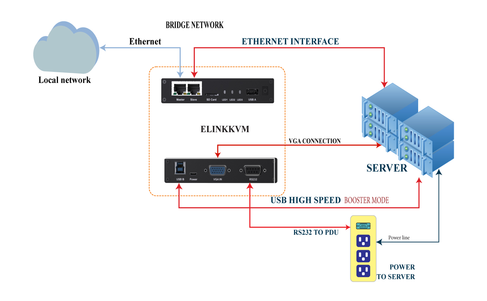
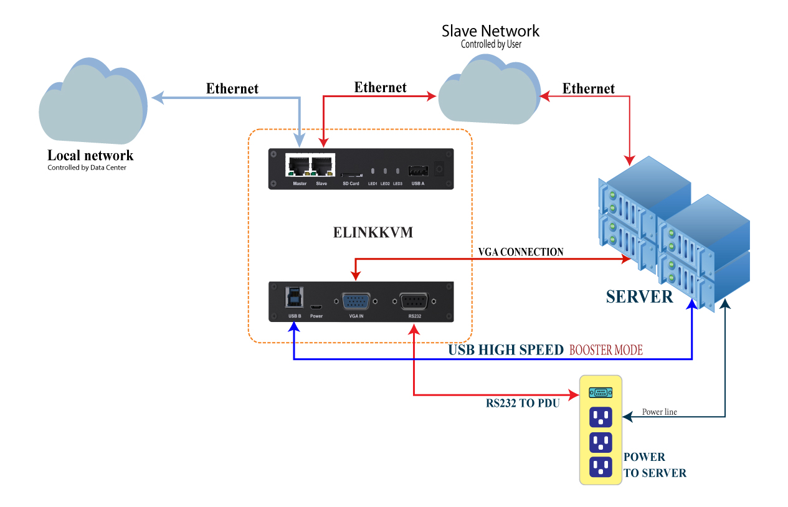
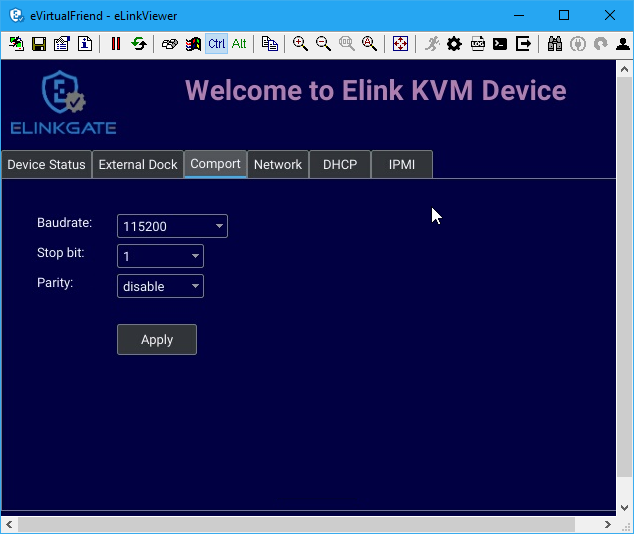
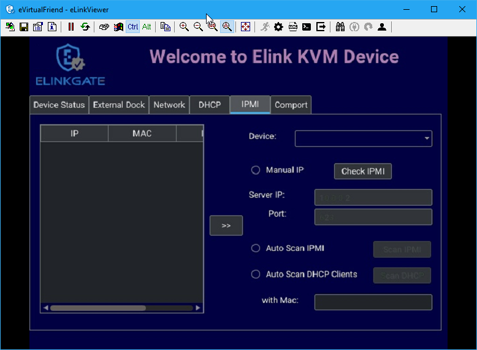
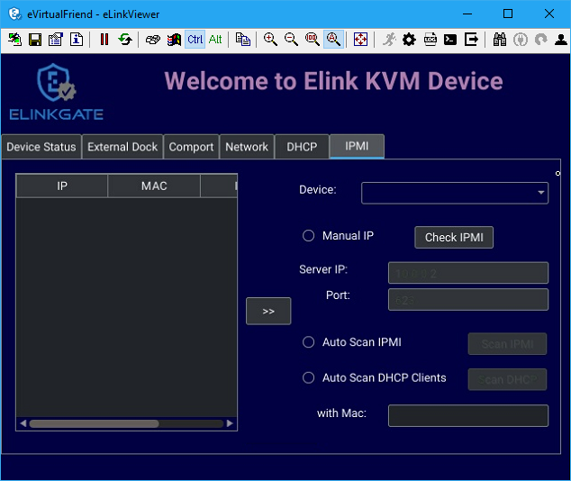
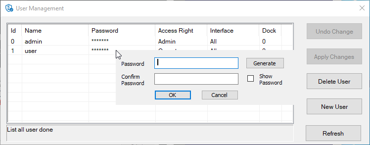

== About eLinkGate
'''
eLinkGate is a company whose aim is to help people learn
about IT. eLinkGate has patented a technology called eLinkMe – a USB
device that allows an IT expert to remotely access a computer, smart
phone or tablet to fix any problem the user may have. Our eLinkMe
technology has the following advantages

- *Simple*: No pre-install software or hardware required
- *Smart*: Ability to work when there is no OS (works at BIOS level)
- *Safe*: Protects user data and service provider data

It is our belief that the eLinkMe technology, as well as our future
technologies will enable users to easily request online
service. Inexperienced users who lack sufficient knowledge about
computers such as farmers, housewives and the elderly can also begin
to find support that will make their life better. eLinkMe can also
assist service providers in providing more services online, while
allowing customers to review their results face to face, without
worrying about online theft.

<<<
== Introduction
'''
=== Overview
A KVM switch (an abbreviation stands for **K**eyboard, **V**ideo and
**M**ouse") is a hardware device that enables a user to control
multiple computers from one or more sets of keyboards, video monitors,
and mice.

****
.KVM SWitch interworking

The computer on the right is currently being controlled by the
peripherals. Only one set of keyboard and mouse is required to control
multiple computers, each connected to a monitor. A user can switch
between each monitor to see the output of each connected computer (to
that monitor).
****

Normal KVM switches attach controlling and controlled devices directly
to itself. In contrast, KVM over-IP switches, provides over-the-internet
functionality. This means, instead of physically connected to a KVM
switch through very long cables and are usually limited in a room, a
floor or a building, the controlling devices can be anywhere in the
world that can connect to a KVM over-IP switch and control the connected
computers with a normal Internet connection.

Another approach for remote controlling is using pure software. However,
as a pure software solution is usually limited only in an operating
system environment. Without an operating system, a software solution is
infeasible. Unlike software solutions for remote controlling, a hardware
solution like a KVM switch can be used as a replacement for a computer
monitor. This diagram demonstrates the scope difference between a
software and a hardware solution:

.Hardware and Software remote control scopes

eLinkKVM is one of such KVM-over-IP devices. However, unlike other
KVM-over-IP solutions that are solely hardware solutions, eLinkKVM
takes on a unique hybrid approach that combines both hardware and
software.  While being a hardware solution similar to other
KVM-over-IP switches, but unlike other KVM-over-IP switches, eLinkKVM
takes a step further with its patented technology called
`*Booster*`. `*Booster*` is a software solution that works together
with eLinkKVM hardware to uplift processing performance by utilizing
computing resources of the remote hosts.  `*Booster*` is not limited
to an operating system environment, but also in BIOS and UEFI
environments.

Operators can monitor and access their computers from remote locations
using a remote control software. An eLinkKVM device connects to a local
area network or directly to a personal computer (PC) using a standard
ethernet cable, then uses a USB cable and a video display cables to
connect to a server and complete control it with Keyboard, Video and
Mouse functionality from the eLinkKVM device.

Because the eLinkKVM uses the Internet as its data communication medium,
the server it is connected to can be accessed from any authorized
computer across the Internet, regardless of physical location.

A user at a remote location connect to the eLinkKVM via its IP address.
Once a connection has been established and authorization granted, the
remote computer can exchange keyboard, video and mouse signals with the
remote server (of which the eLinkKVM is attached to), just as if they
were physically present and working on the equipment directly.

=== Booster technology

`*Booster*` is a patented technology that allows eLinkKVM to utilize
computing resources from remote hosts to improve remote
performance. To quickly summarize, `*Booster*` includes software agents
that work on major OS platforms (Windows, Linux and Mac OS)
however,unlike traditional software solutions, `*Booster*` agents can also
operate in BIOS and UEFI environments, independent of any operating
system.

These software agents are installed on remote hosts to utilize the extra
computing power on the remote hosts to accelerate screen data processing
without affecting performance. This enables higher quality remote screen
and more responsive interactions with the remotely remote hosts.

`*Booster*` also helps reducing the loads on eLinkKVM devices, making
eLinkKVM devices run cooler and extend the longevity of eLinkKVM
devices, while delivering higher performance.

The following diagram shows the scope covered by Booster:

.Booster operating scope

=== Features

The eLinkKVM is designed to help the IT person remotely operate the
Server in most responsive and efficient way. The device is not only
allowing remotely access at Bios Level which is similar traditional KVM
over IP but also adding more features:

Full Bios-level control over an IP Network::
The video capture hardware (Hardware mode) is designed to decode the
video signal up to 1920x1080 that help to monitor the screen in any
situation.

Patented Booster technology::
Faster and higher resolution with `*Booster*` technology, a patent
technology allows monitor the screen with faster transfer, any video
resolution with just a USB connection for almost any situation. See the
`*Booster*` chapter for more information.

Featureful native client software::
Client software is bundled with many unique features: scripting and
image recognition, to automate manual operations. See the eLinkViewer
chapter for more information.

Virtual Media support with 8GB Internal Flash or 64GB with SD Card::

Instead of using a separate computer as a share network storage to
emulate the Virtual Media, eLinkKVM itself is a high performance shared
network storage device.

USB-Powered Design::

The power is getting from USB port of Server, no external power supply
required

RS232 Serial Port::

For Serial Console, Remote Dial In or control external PDU

Built-in IPMI (Intelligent Platform Management Interface) utility::

eLinkKVM understands IPMI and allows control the server that support
IPMI interface. The user may power on/off/reset server without using an
external PDU

Support USB Host Interface::

The USB Host port allow eLinkKVM control the USB 3G/4G, external USB
storage or USB security device to add more functionality.

Flexible Two Ethernet Ports::

The Ethernet ports can be configured to work independently to connect 2
different networks with the master port can be configured as a DHCP
server. Or 2 ports can be used to connect a server to a router, using a
single server Ethernet port.

Built-In USB Hub::

Physically emulate all USB device (Mouse, Keyboard, Storage) with just
one USB cables

Scalability::

eLinkKVM can scale to control more than one computers by connecting the
computers to eLinkSwitch.

Compact form factor::

Small footprint of eLinkKVM making it easy to attach to existing servers

Low cost::

Ideal for distributed IT system environments such as small branch
offices, campuses, test labs, and server hosting environments.

Remote firmware upgrade::
Firmware can be easily upgraded remotely with a few mouse clicks.

=== eLinkKVM Physical Connections

eLinKVM can be flexibly setup to connect between a remote terminal and a
remote host with many options.

To connect a remote terminal over IP, the following methods can be used:

* Connect eLinkKVM directly to a router. A remote terminal then can
access eLinkKVM over the Internet.

* Connect eLinkKVM directly to a USB 3G/4G. A remote terminal then can
access eLinkKVM over the Internet.

* Direct connect eLinkKVM to the remote terminal. A remote terminal then
can access eLinkKVM with a direct connection, Internet is not required.

After setting up, eLinkKVM is ready to be accessed by a remote terminal.

To connect a remote host to an already connected eLinkKVM device, the
following methods can be used:

* Connect a VGA cable between the remote host and eLinkKVM to capture
the host screen.

* Using a RS232 cable to capture its serial output.

* Connect the remote host to the Slave port on eLinkKVM to manage
through IPMI interface.

After phsyical connections on both ends are done, a remote connection is
up and running.

.Complete system eLinkKVM connect to Router, connect to IPMI server, USB, RS232, external PDU, USB 3G, etc.
image::../../Resource/ElinkGate_full_connection.jpg[image]

.ELinkKVM Lite A minimal connection just USB (to run Booster), eLinkKVM connect to Router, eLinkKVM connect to IPMI_

.Using feature network bridge to save network connection (network cable to eLinkKVM to Master Connector & from Slave Connector to Server), eLinkKVM connect USB to server

.Seperate network layer

.Extend function with USB device
image::../../Resource/elinkkvm_multiple_usb_device.jpg[image]

.ELinkKVM configure network through multiple network

=== Technical Specifications

==== Hardware specification

[cols="^.^3,<.^7"]
|===
|Feature |Description

|Networks
|`2` Ethernet ports (`10/100Mbps`)

|Storage
|Internal Flash Storage (`8GB`) that can be accessed by eLinkViewer software

|Interfaces
|
Micro SD-CARD (extend up to `64GB`)
RS232 interface
USB Host interface to extend to USB 3G/4G, USB Wifi, USB Storage

|Video
|
VGA Port, Video Full HD Resolution
VGA Text mode: `640x350, 640x480, 720x400`
VGA Graphic mode: `640x480, 800x600, 1024x768, 1152x864, 1280x1024,
1440x900,1680x1050,1600x1200,1920 x1080`
Secure, full BIOS-level control of remote servers over an IP network
|===

==== Software Specification

[cols="^.^3,<.^7"]
|===
|Feature |Description

|Remote Access Features
|
Support VNC Protocol

Emulation the USB Relative Mouse and Absolute Mouse

Emulation the USB Keyboard

Capture Full HD resolution with `Hardware Mode`

Capture all resolutions with 100% screen quality using the patented
`Booster Mode`

|Connections
|
Direct Connect Through TCP/IP

Extension through USB 3G/4G

Coming the Cloud Service to connect behind Firewall

|Securities
|
Secure by SSL

Multiple Login Accounts (Up to `8 users`)

|Remote Server Power Control
|
Remote Reset/On/Off Server through an IPMI

GUI Interface from eLinkViewer

Control the External PDU through RS232

|Virtual Media
|Disk images (.iso, .raw, .hdd, .hdd2 can be mounted as a USB 2.0
devices on

|Server power design
|No external power supply required on a remote computer for easy
software installation and system updates

|Multi-purpose USB port
|Keyboard, Mouse and Storage functionalities are integrated in a
single USB port.

|Compact form factor |Making it easier to attach to existing servers

|Batch setup
|Multiple eLinkKVM devices can be scripted by the eLinkViewer software
to get the same configuration.
|===

==== eLinkViewer Software Specification

*eLinkViewer* is an application specifically made to view remote screen
content captured by an eLinkKVM device as well as interact with a remote
computer.

*eLinkViewer* also provides functionalities to manage an eLinkKVM
device.

[cols="^.^3,<.^7"]
|===
|Feature |Description

|General
|
Support multiple VNC Server and eLinkKVM

Remote protocol using VNC and extension commands for eLinkKVM

Support video scaling and full screen

|Automation
|Support image recognization and Python scripting allow automation the
activities

|IPMI
|Support IPMI protocol to control server with GUI

|Platform
|Currently support Windows

|Bandwidth Optimization
|Provide video quality settings to maximize remote performance for the
available network bandwith

|Screen scaling
|Viewer screen can be scaled to any resolution independent from remote
 computer's resolution or even enter a full-screen mode. In
 full-screen mode, the viewer screen scales according to the remote
 computer's resolution.
|===

<<<
=== Components

Front and rear views of an eLinkKVM device:

==== Front view

[cols="^.^1,^.^3,<.^6"]
|===
|ID |Component |Description

|1
|Ethernet ports (10/100Mbps)
|
Master: can be configured as a DHCP server, a DHCP client or a
static IP 

Slave: can be configured as a DHCP Client or a static IP

|2
|SD card
|Allows a user to expand storage capacity with an external micro SD
card

|3
|Status Leds 1,2,3
|Signal device statuses through different led colors

|4
|USB Type-A
|Allow to attach an external peripheral device such as USB 3G/4G, USB
Mass Storage, etc., to extend eLinkKVM functionality.
|===

<<<
==== Rear view

[cols="^1,^3,6"]
|===
|ID |Component |Description

|1
|USB Type-B
|Power the device and acts as a communication channel between eLinkKVM
and a server

|2
|Power
|The secondary source is supplied by a micro USB cable. It is
neccessary when the power from USB Type B port is insufficient, or
keeping the connection to eLinkKVM alive when the server is power off.

|3
|VGA
|For capturing and outputting video signal to send and receive over
the internet.

|4
|RS232
|The serial communication port (COM port**. This port will be
connected to the server serial port.
|===

<<<

include::elinkkvm_quick_guide_chapter.adoc[]

<<<
== eLinkViewer
'''

eLinkViewer is a specialized software for remote control and management
of an eLinkKVM device. `*Booster*` technology is only available with
eLinkViewer.

=== Login
==== Establish connection
To connect to an eLinkKVM device, fill the configured IP address in the
textbox next to the *Server* field and click `Connect` to connect
eLinkViewer to the eLinkKVM at the configured IP address:

.eLinkViewer quick connectd UI
image::../../Resource/EV_login_ui.png[Elinkviewr Quick Connect]

`Options`: configure eLinkKVM-VNC connection

.Connection options

* Scan: Scan for all eLinkKVM devices in the current local area network (LAN)

ifdef::html[]
.Scanning process

endif::[]

After connecting to an eLinkKVM device, the viewer screen switches to
`Dummy` screen. The `Dummy` screen displays device status and
settings.

ifdef::html[]
// image::https://lh3.googleusercontent.com/-k1OlzAGTAV4/XD1OfGcsRSI/AAAAAAAARDI/wBXQ4kye0Nk9B6CJZrmWXbEEwAWx1bxbACHMYCw/s0/elinkviewer_2019-01-15_10-07-38.png[Dummy Screen]
endif::[]

// image::../../Resource/elinkview_dummy_screen.webp[image]
==== Device authenticate
After establishing a new connection to ELinkKVM, the device should require an authenticate process. Currently, support authenticate by plain user name/password likve bellow

.ELinkKVM login UI

==== Disconnect from an eLinkKVM device

* Click the button 
* The following dialog box shows the connection has been terminated:

.Exit connection dialog

=== Basic Remote Control

==== ELink Configuration UI
ELinkViewer support UI to configure ELinkKVM.
Open ELink Configuration Dialog:

1. Click `ELink Configuration`. +
image:../../Resource/EV_click_config.png[width=150]
2. ELink Configurationn show up: +

==== Remote screen capture
//TODO
. Click `ELink Configuration` icon in toolbar for open `ELink Configuration` dialog
. Select a video which want to switch to. For example: Select VGA video mode +
image:../../Resource/EV_config_VGA_active.png[width=150]
. Click Ok to apply the new configuration. In the case, eLinkViewer displayed VGA output of server +

==== Emulate Mouse device:
//TODO
. Click `ELink Configuration` icon in toolbar for open `ELink Configuration` dialog
. Enable a Mouse Mode and active the mode. For example: Enable Mouse ABS USB Mode and active the mode  +

. Click `OK` to apply the new `Mouse mode`

==== Emulate Key device:
//Why we need emulate Key device,
Key Mode::
** HID USB : use real keyboard (USB).
** HID VNC : use software keyboard (VNC protocol)
** Serial: use software keyboard (serial protocol)
Configure `Keyboard Mode`::
. Click `ELink Configuration` icon in toolbar for open `ELink Configuration` dialog
. Enable a Keyboard Mode and active the mode. For example: Enable `HID USB Mode` and active the mode  +
image:../../Resource/EV_config_kv_hidusb_active.png[width=150]
. Click `OK` to apply the new `Keyboard mode`

==== Emulate Virtual USB media :
Configure to mount an iamge as a `virtual USB media`::
. Click `ELink Configuration` icon in toolbar for open `ELink Configuration` dialog
. Click button `Browser` to browse file in ELink-KVM remotely.
. Select an image file (format iso/hdd/hdd2) and click button `<<` to specific the image should be mount
. Click `OK` to apply the mount image

.Emulate ELinkKVM as a virutal USB media

=== Advance Remote Control
//TODO Description

==== File Transfer

eLinkViewer allows data transfer from a local PC to an eLinkKVM device
with `File Transfer`:

.File Transfer UI

* Click *`File Transfer`* on eLinkViewer toolbar . `File Transfer`
window appears. To the left is a directory tree of the local PC, to
the right is the directory tree of the eLinkKVM device.
* Browse the local directory tree and select a file or directory to
upload to an eLinkKVM device. Next, on the directory tree of the
eLinkKVM device, select a path to store the file or directory.
* Finally, click the button *`>>`* to transfer the selected
file/directory. A confirm dialog appears. Click *`Yes`* to confirm or
click *`No`* cancel the action. After confirming the transfer, the
transfer starts and a progress bar that displays the transfering process
starts running.

==== Dummy Screen

===== Device Status

The default screen when successfully connected to an ElinkKVM device.

.Device status UI
image::../../Resource/elinkviewer_dummy_screen_deviceinfo.png[Dummy screen]

===== External Dock

Display basic info of Dock if current eLinkKVM connected to a eLink Dock

.Dummy Info Status UI

===== Networks

Display the current network configuration of an eLinkKVM device and
allows changes accordingly:

.Network Configuration UI

===== COM Port

Display the current COM port configuration of an eLinkKVM device and
allows changes accordingly:

.COM Port UI

===== DHCP

Display all IP address already allocated by DHCP server of eLinkKVM

.DHCP Configuration UI

===== Virtual IPMI Server

Display the current IPMI configuration of an eLinkKVM device and allows
changes accordingly:

==== Serial Console

==== Python Console UI

eLinkKVM allows eLinkKVM to be controlled by scripting with Python. On
the toolbar, the button `Python Console Script` open a Python console
similar to regular Python console but with Python eLinkSDK already
loaded. A user can interactively use the Python console by typing code
directly on it.

.Python Console UI

The Python console can also launch a script from the command line:

[listing]
elinkviewer.exe -cons=setup_win2012.py

The Python console appears to display script output, error and exception
if any.

==== Firmware Upgrade
Step by step to upgrade firmware for ELinkKVM

* Firwmare upgrade by open `eLinkViewer File Transfer dialog`
* Transfering firmware file from local to ELinkKVM EMMC (`A:\`)
* Double click to firmware file in ELinkKVM
* Click button `Firmware` to ELinkKVM with the selected firmware file

.Firmware upgrade

.Firmware upgrade process

After upgrade firmware process complete, device will automatic restart. verifying firmware version by click info button in elinkviewer

.Connection info

in `Connection Information` display info of firmware version. In the case is `Firmware: 01.04.01.07`

==== IPMI Command Center

IPMI Interface:

.eLinkViewer IPMI Command Center

IPMI command center allows a user to scan servers with IPMI ports in a
local area network and connect to these server to run IPMI commands.

* `Start IP`: start IP to begin scanning
* `Stop IP`: End IP to end scanning
* `User Name` - `Password`: user name and password for each IPMI server. For
example, default username and password are ADMIN/ADMIN for a Super Micro
server.
* `Scan` : start scanning for an IPMI server
* `Stop`: End a current scanning process
* `Connect`: connects to an IPMI server. When an IPMI server is found, an
IP address is display, click on the IP address to select then enter a
Username and Password.
* `Power On`: Turn a server on with IPMI
* `Reset` with options:

.IPMI Reset with options

** `Reset` : restart a server
** `Reset to Bios Setup`: restart a server and enter BIOS
** `Reset to USB`: restart a server and boot with a USB device

* `Sol Active`: enable IPMI management with Serial Over Lan (SOL)
* `Close` : Close IPMI command center

Use IPMI command center to scan and run IPMI commands.

* Click 
* Enter Start IP and end IP. Limit the ranger of IP scanning.
* Click `Scan` to start scanning. Found IPMI servers are displayed as
a list.
* Click on one of the found IPMI IP addresses, enter `Username` and `Password`, then click *`Connect`*
* Click *`Power On`*, *`Reset`*, etc., to run appropriate IPMI commands.

Example:

* Open `IPMI Command Center` dialog:

.IPMI scanning process dialog

* Select IPMI Ip addr  and enter user name/password: `root/root` and click connect

.IPMI connect to IPMI server

* select reset option to `reset to Bios` and click button `Reset`

.Reset to `Bios` IPMI server by reset command

* Reset command success

.Reset to `Bios` IPMI server by reset command

==== eLinkViewer Image Capture

To capture the current eLinkViewer screen or a part of it:

* Press the `Pause`  button +
* After the screen is paused, hold the `Ctrl` button. +
* While holding the `Ctrl` button, drag the mouse to select a capture
region. +
* Elinkviewer stored the capture screen as file `tmp<count>.png` like this: +
 in folder run `elinkviewer.exe`

.Capture screen
image::../../Resource/elinkviewer_capture_screen.png[]

=== Utility

==== Event Log UI

Event log displays events and performance metrics related to eLinkKVM.

.Event Log UI
image::../../Resource/EventLog.png[image]

==== eLinkKVM Toolbar

Connection user interface:

.eLinkViewer Toolbar 

.  Create a new connect to an eLinkKVM device

.Create New Connection

[start=2]
. Store current vnc session as a `.vnc` file
. eLinkKVM connect options

.Connection Options
image::../../Resource/ToolbarConnectOptions.png[ToolbarConnectOptions]

[start=4]
. Current connection status
. Pause frame transmitting
. Request refresh current remote screen
. Send `Ctrl + Alt + Delete` key combination
. Press/Hold `Ctrl` key
. Press/Hold `Alt` key
. Open eLinkViewer `File Transfer` window
. Scale in
. Scale out
. Scale (100%)
. Auto zoom
. Full screen (press `Ctrl + Shift + Alt + F` to return to windowed
eLinkViewer)
. Turn booster mode on/off
. eLinkKVM Configuration
. Open event log
. Open Python script command prompt
. Disconnect
. Scan IPMI

==== Python Console UI

eLinkKVM allows eLinkKVM to be controlled by scripting with Python. On
the toolbar, the button `Python Console Script` open a Python console
similar to regular Python console but with Python eLinkSDK already
loaded. A user can interactively use the Python console by typing code
directly on it.

.Python Console UI

The Python console can also launch a script from the command line:

[listing]
elinkviewer.exe -cons=setup_win2012.py

The Python console appears to display script output, error and exception
if any.

==== Event Log UI

Event log displays events and performance metrics related to eLinkKVM.

.Event Log UI
image::../../Resource/EventLog.png[image]

==== Serial Console

==== eLinkViewer Image Capture

To capture the current eLinkViewer screen or a part of it:

* Press the `Pause`  button +
* After the screen is paused, hold the `Ctrl` button. +
* While holding the `Ctrl` button, drag the mouse to select a capture
region. +
* Elinkviewer stored the capture screen as file `tmp<count>.png` like this: +
 in folder run `elinkviewer.exe`

.Capture screen
image::../../Resource/elinkviewer_capture_screen.png[]

<<<
== eLinkKVM Configuration
'''

=== User Management
* Support up to 8 user accounts
* Multiple level management : The higher level can interrupt connection and modify atribute of lower level user account
  ** Admin  : `Top level` account Data center  admin account. Can create other lower priority account types like Manager and User
  ** Manager:  `Middle  level` User manager account. Can create User account
  ** Operator:  Access account

NOTE: For the *First Time Configure*, the default user name and password of ELinkKVM is `admin/admin`

==== User login
Fill User name/password to log in ELinkKVM

.ELinkKVM login UI

==== Manage User acounts in ELinkKVM

* Click to icon User Configure bellow to open User Account Configuration

.Account login UI

.User management dialog

* *Create new account*
 ** Click `New User`  to create new account
 ** Double click to a cell for edit their attribute.

For example: Double click to password cell of new user to show password configure dialog

.Double click to password field and set password for the new user account

Input password and confirm the password

.Click to Access Right field to modify the right of an account

click `Apply Changes` to apply all new configuration

NOTE: click `Generate` buttont for auto generate password, Also can modified attribute of existed user acount by click to select account need to modify

WARNING: Only Admin/Account can run User management

=== Network Configuration

Static IP configuration::

Steps to configure static IP for an eLinkKVM device:

.  Power up an eLinkKVM device and wait for the device to start up
completely (all LED1 , LED2, LED 3 light up).
.  Use a Ethernet (RJ45) cable to connect a PC to the Ethernet Master
port. The default IP is `10.0.0.1`.
.  Open eLinkViewer, enter `*10.0.0.1*` and click `Connect` to connect
to the eLinkKVM device:

.Connect to Master ethernet port

When connected, eLinkViewer displays its home screen with many tabs
for different screens. One of the tab is `Network`. Click on `Network`
tab to move to this screen:

.eLinkKVM configure
image::../../Resource/elinkviewer_dummy_network.png[eLinkKVM configure]

.  The `Network` screen displays the following fields:

** IP Address
** Netmask
** Gateway
** DNS

Similar to how an ethernet adapter can be configured in an operating system.

Dynamic IP Configuration::

Dynamic IP address is acquired automatically, issued by a DHCP server.
In this case, the connected eLinkKVM device must be configured as a DHCP
client.

.Select DHCP client

//=== Virtual IPMI Configuration
//TODO need to add IPMI configuration

=== Offline Configuration

eLinkKVM supports configuration with a text file. Steps:

.Configure eLinkKVM with a text file

.  Press `Enter Configuration` button an eLinkKVM device. The firmware
on the eLinkKVM device then configures itself as a storage device.
.  Open the drive `ELINKCONF`.
.  In `ELINKCONF` drive, there is a configuration file that can be
editted by any text editor.
.  Edit the file following eLinkKVM configuration syntax. Store the
file and reset eLinkKVM to use the new configuration.
.  Press button `Enter configuration` button again to exit configuration mode

ifdef::html[]
.Offline configure
image::../../Resource/EK_offline_configura.gif[ScaneLinkKVM]
endif::[]

=== Factory Reset
Support Hardware factory reset

. Press and hold button for 3 seconds till all 3 leds blinks in red color then release the button
. Press and hold (3 seconds) again till LED1 blinks green  to confirm action factory reset, the board factory resets and then reboots.

<<<
== Booster
'''

`*Booster*` is a patented technology for eLinkKVM and related ElinkGate
products. `*Booster*` includes software agents for each major OS platform
(Windows, Linux and Mac OS) that are installed on controlled computers.
When an eLinkKVM device is attached to a controlled computer, the
installed software agent is activated to cooperate with a eLinkKVM
device using a specialized proprieteray protocol. The software agent
then utilizes the available computing resources on the remote host to
greately accelerate video input and output processing. As a result,
eLinkKVM can deliver higher performance at higher resolutions for an
extremely economical price.

To enable `*Booster*` techonlogy, a user only needs to install the
accompanied software components on an existing operating-system
installation. For a fresh computer that need a new operating-system
installation, a tool called `elinkSetuptool` is provided to help
creating install disk images with embedded `*Booster*` from existing
installation ISO files, which is covered in the next chapter.

These disk images can be loaded on eLinkKVM internal storage for remote
operating-system installations on new computers with `*Booster*` enabled
through the whole installation process. After the installation process
is done, the freshly installed operating system is also pre-installed
with `*Booster*` software to allow a user to continue using `*Booster*` without
any interruption.

.Booster operating scope

Once a `*Booster*` agent is installed on a respective operating system,
simply click the `*Booster*` icon to start getting remote screen with
Booster.

.Booster enabled
image::../../Resource/BoosterScreen.png[BoosterToogle]

Screen quality may improve slightly or significantly compared to VGA
hardwrae mode, depends on the quality of the VGA cable. Remote keyboard
and mouse interactions become much more responsive.

=== Booster Configuration

To make it convenient to switch between `*Booster*` and other modes,
eLinkViewer allows a user to customize Auto `*Booster*` Toggle button.
Pressing this button allows a user to switch between a pre-configured
Booster mode and the current mode.

.Booster Configuration UI

Steps to configure `*Booster*` mode:

.  Click `ELink Configuration` button.
.  From `ELink Configuration` select a remote display mode.
.  Similarly, select a Key mode
.  Next, select a Mouse mode
.  Select `Base` to confirm configuration. This configuration is used
whenever `Auto Booster Mode` button is clicked.
.  Press OK to save the configuration.
.  Press OK to confirm.

// TODO: Add a static version
// image::https://drive.google.com/a/elinkgate.com/uc?id=1yJGy1_O6FCYe0uyvxdja5eGSYl8vvWfC[Booster mode remote control]

=== Booster for Windows

Follow these steps to install and use `*Booster*` on Windows:

- Logged into the computer to be a remote host.
- Download `setup_elinkagent.exe` on the website.
- Click the exe file, follow the installer instructions to install the agent.
- After the installation, run `elinkserver.exe` to enable `*Booster*` on the remote host.
- On the remote terminal, connect the remmote host with `eLinkViewer`.
- Click `Elink Configuration` -> `Browse` then select  `A:\floppy.hdd2`.
- Clicking `*Booster*` to activate remote with Booster.

=== Booster for Linux (Non supported yet)

Follow these steps to install and use `*Booster*` on Linu:

- Logged into the computer to be a remote host.
- Download setup package for a distro, .e.g. `.deb` for Ubuntu, `.rpm` for Fedora.
- Install the packages.
- On Ubuntu: `sudo apt-get install elinkagent.deb`
- On Feodra: `sudo apt-get install elinkagent.rpm`

- After the installation, run `elinkserver` to enable `*Booster*` on the remote host.
- On the remote terminal, connect the remmote host with `eLinkViewer`.
- Click `Elink Configuration` -> `Browse` then select  `A:\floppy.hdd2`.
- Clicking `*Booster*` to activate remote with Booster.

=== Booster for UEFI

By default, when installing the setup packages for an appropriate
operating system, `*Booster*` is also installed for UEFI
boltloader. Whenever an operating system enters a non-graphical
environment in UEFI, `*Booster*` can be used without any restriction.

=== Embbed Booster into operating system setup images with eLinkSetupTool

`*Booster*` can run in a setup environment of an operating system
when it is being installed on a computer. To use this feature, the
setup disk images must be recreated with an appropriate `*Booster*`
agent embedded, using `eLinkSetupTool`, a disk creation image
tool. `*Booster*` is enabled as soon as the setup image is loaded by
the remote host computer.

==== eLinkSetupTool instalation

On Windows::

* Download `setuptool.exe`.
* Click the installer and follows the instructions.

On Ubuntu::

* Download `setuptool.deb`.
* Install it:

[listing]
sudo apt-get install setuptool.deb

On Fedora::

* Download `setuptool.rpm`:

[listing]
sudo dnf install setuptool.rpm

After the installation, `vfimg` command should be available globally to be used in a terminal program, e.g. `cmd.exe` on Windows.

NOTE: the setup files is above, e.g. `setuptool.exe` should be clickable
to download

=== eLinkSetupTool usage
==== Create OS setup image

To create a new disk image, simply run the following command:

[listing]
vfimg /create-image Win2012.hdd2 /iso Win2012.iso

The command produces the following output:

----
Initializing environment...Done.
Start Analyzing image...Found a Windows 2012 ISO. Done
Format HDD image to FAT32...Done.
Generate elinkme_dummy.dat...Done.
Copy files from ISO to HDD...Done.
Installing vfservice to boot.wim...Done.
Installing vfservice to UEFI...Done.
Generate Embedded Hddx at the end of HDD file...Done
----

The above command creates a new image `Win2012.hdd2` with `*Booster*` agent embedded from the original Windows setup image `Win2012.iso`.

Once the new image is created, upload it to eLinkKVM with `File Transfer`. To use the new image::

- Click `Elink Configuration` -> `Browse`.
- Browse to the uploaded `Win2012.hdd2` and select it.
- `Win2012.hdd2` is now exposed to the remote host computer as a USB drive and is selectable as a boot device in the BIOS.

==== Create a minimal floppy image

eLinkKVM is already bundled with the minimal image `floppy.hdd2` in its interal storage that can be mounted as a floppy disk drive.
For some reason, if the disk is deleted, a user can recreate and reupload the image. To create the floppy image, run the following command:

[listing]
vfimg /make-floppy floppy.hdd2

==== Install UEFI Booster agent to an existing disk image

Aside from OS setup images, there are disk images that contain
troubleshooting tools running in the UEFI environment. To create
new images with UEFI `*Booster*` agent, run the following command:

[listing]
vfimg /install-uefi img.hdd2

==== Display version information:

To show the current setuptool version, run the following command:

[listing]
vfimg /version

<<<

