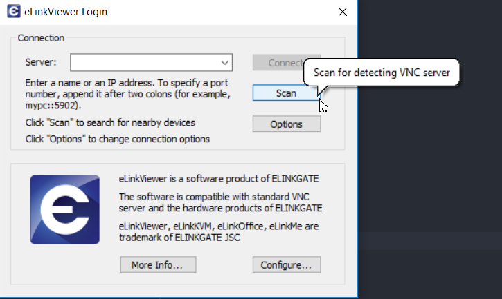
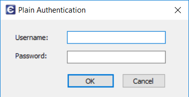
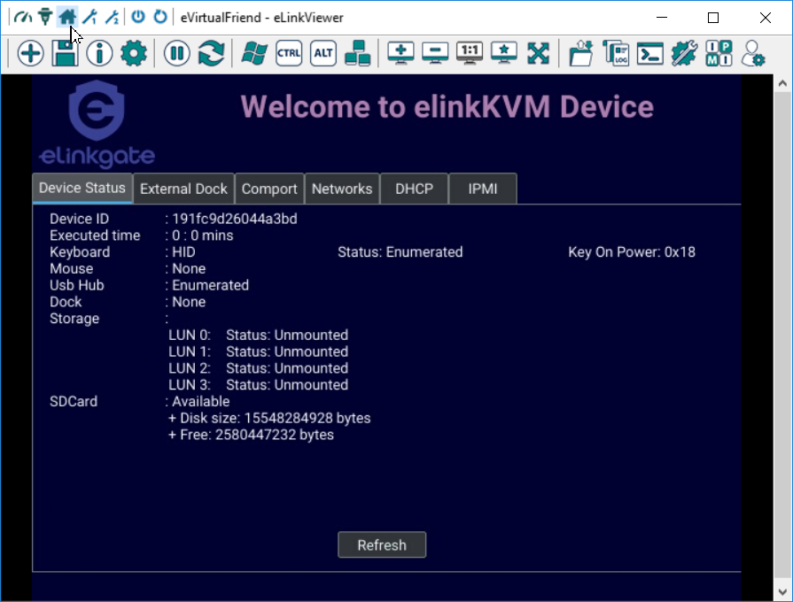

== elinkKVM quick start guide
'''

This chapter describes how to install the elinkKVM device and necessary
software to work with elinkKVM . It contains the following sections:

* Package contents
* Power on elinkKVM
* elinkKVM in Setup Mode
* elinkKVM in Operating Mode
* Network setup
* elinkViewer setup

=== Package Contents

In addition to the *elinkKVM* device, the package contains the following
items:

* `1` USB 2.0 Type-B Cable
* `1` VGA cable
* `1` RS232 cable (optional)
* `1` Micro USB cable
* `1` USB Power Adapter (5V - 2A)
* `1` elinkKVM Quick Start Guide

=== Power On elinkKVM

The USB-Powered design allows elinkKVM power directly from server USB
port (1) without an external power. But in some cases, it is necessary
to keep the device active while the server can be turned off or elinkKVM
needs to provide the power to external USB device. This can be done by
supplying another 5V power source to the micro USB port (2) on an
elinkKVM device.

.Rear USB ports for powering up an elinkKVM device
image::../../Resource/eLinkKVM_front_power.png[Dummy Screen,width=600]

During the bootup process, the 3 LEDs will blink and turn green when
the device is ready. Now, the user can start using the device.

.Front status LEDs
image::../../Resource/eLinkKVM_back_led.png[Dummy Screen, width=600]

[cols="^.^1,^.^3,<.^6"]
|===
|LED ID |Color |Description

|1 |Green |The system is initialized successfully
|2 |Green |The network slave port is ready
|3 |Green |The network master port is ready

|===

=== elinkKVM in Setup Mode
.elinkKVM connection in Setup mode

The elinkKVM is designed to be just plug and play. User can simply install
the device in operation mode and start using immediately. But, there are
some cases when the auto DHCP IP address may not work. The user may have
to setup it manually. Below are the connection diagrams when setup
elinkKVM.

Perform following steps to configure elinkKVM in Setup Mode:

. Connect Ethernet RJ45 cable between eLinkKVM and remote terminal computer.
. Connect USB Type-B cable to remote terminal computer and Type-B port of
eLinkKVM device.

.Connection of an elinkKVM device in Setup Mode
image::../../Resource/eLinkKVM_setup_mode_guide.png[Dummy Screen, width=600]

<<<
=== elinkKVM in Basic Operation Mode
The main usage of elinkKVM is to remotely monitor a server. The basic
connection is described below, where elinkKVM is connected to Server
through USB cable and VGA. It is also connected to remote terminal through
Ethernet.

.Basic eLinkKVM Operation Mode
image::../../Resource/eLinkKVM_connection.png[Multiple network layer, width=600]

Perform following steps to configure elinkKVM:

1.  Connect Ethernet RJ45 cable between elinkKVM and remote terminal computer.
2.  Connect VGA cable between Server and VGA port on elinkKVM.
3.  Connect USB Type-B cable between Server USB port and Type-B port
of elinkKVM device.

.elinkKVM connection (basic operation mode)

=== Network configuration

elinkKVM supports two Ethernet ports for network connection:

* Ethernet Master: by default, configured as a DHCP server.
* Ethernet Slave: by default, configured as a DHCP client.

In order to connect to an elinkKVM device, a network connection between a remote
terminal and an eLinkKVM device is required. The connection can either
be:

* _Direct connect_: An Ethernet cable connects directly between a remote
terminal and an elinkKVM device. In this case, we should configure elinkKVM as
DHCP server (using Master port) and remote terminal as DHCP client.
* _Local Area Network_: Both the remote terminal and an elinkKVM device
are connected to a local area network (LAN). eLinkKVM is plugged to the
router of the network. In this case we should configure elinkKVM (using Slave
port) and remote terminal as DHCP client
* _Over the Internet_: an elinkKVM device is provided a static address
for a remote terminal to access it anywhere in the world.

When a connection is established, the elinkKVM is accessed from remote terminal
by the software elinkViewer. Currently, elinkViewer is only supporting Windows.

=== Setup eLinkViewer

Download the elinkViewer setup package from link:
www.elinkgate.com/support/download.html.

.Setting Button of elinkKVM
image::../../Resource/eLinkKVM_setting_button.png[width=600]

Optionally, the elinkKVM comes with pre-production setup package of elinkViewer.
When LED1 of elinkKVM turns green, short pressing the Setting Button will result
elinkKVM to appear as storage to attached computer. The setup.exe can be found in
the attached storage at folder elinkViewer\setup.exe

.The contents of attached storage
image::../../Resource/elinkTools_CD.png[]

Just run setup.exe and follow the instructions to complete the setup.

<<elinkviewer-chap>> chapter shows how to run and use eLinkViewer.
[[elinkviewer-chap]]
=== elinkViewer quick start

. Run elinkViewer.exe by double clicking the application icon. The login dialog
appears as below.
+
If user knows the elinkKVM address, then just fill in the address and move to
connect step.
Or click on `Scan` button to pop up Service Discovery Dialog to find the elinkKVM.
+
.Establish new connection

. Click on `Scan` button to search for device.
+
.Scan for elinkKVM devices
image::../../Resource/EV_scan_connection1.png[]
. Click `Connect` button to connect to the device
+
When device is detected, it will appear on the dialog. Select the device and click
`Connect` button.
+
.Select the device and click "Connect" button
image::../../Resource/EV_scan_connection2.png[]

. Get the IP address and connect
+
When the IP address is filled either manually or as a result of scan operation
above, user can click on `Connect` button to establish the connection with elinkKVM.
+
.Establish new connection
image::../../Resource/EV_establish_connection2.png[]
. Authenticate with device
+
When connected to elinkKVM, an authentication dialog will pop up to ask for username
and password. The default username and password is `admin/admin`.
+
.eLinkKVM Authentication UI

. Switch to Local Screen.
+
When first connect to elinkKVM, the last used screen will appear. The  default
last used screen is `local screen`, which shows the status and setting of elinkKVM.
If the last used screen is not `local screen`, user can quickly switch to by
clicking on `local screen` icon of quick tool bar.
image:../../Resource/icons/local_quick_button.png[]
+

.Switch to Local Screen

. Switch to VGA Screen
+
If elinkKVM is connected in operation mode, user can see the Server screen by
clicking on `VGA screen` icon of quick tool bar
image:../../Resource/icons/vga_quick_button.png[]

.Switch to VGA Screen
image::../../Resource/EV_vga_screen.png[]

For more detailed operation of elinkKVM, please see `elinkKVM User Manual`.
