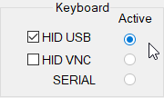
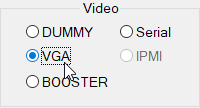
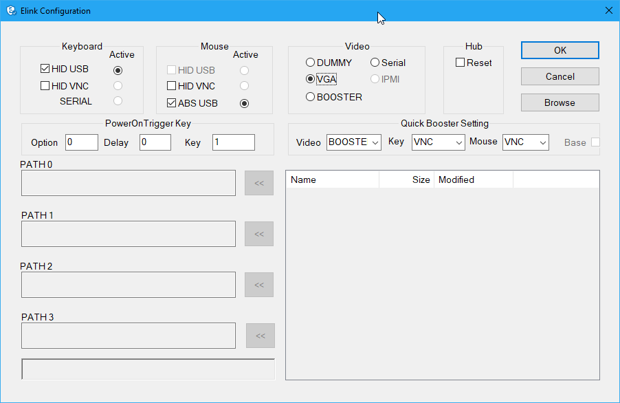

== eLinkKVM quick start
'''

This chapter describes how to install the eLinkKVM device and necessary
software to work with eLinkKVM . It contains the following sections:

* Package contents
* Power on eLinkKVM
* eLinkKVM in Setup Mode
* eLinkKVM in Operating Mode
* Network setup
* eLinkViewer setup

=== Package Contents

In addition to the *eLinkKVM* device, the package contains the following
items:

* `1` USB 2.0 Type-B Cable
* `1` VGA cable
* `1` RS232 cable (optional)
* `1` Micro USB cable
* `1` USB Power Adapter (5V - 2A) 
* Quick Start Guide

=== Power On eLinkKVM

The USB-Powered design allow eLinkKVM power directly from server USB
port (1) without an external power. But in some cases, it is necessary
to keep the device active while the server can be turned off or eLinkKVM
need to provide the power to external USB 3G. This can be done by
supplying another 5V power source to the micro USB port (2) on an
eLinkKVM device.

.Rear USB ports for powering up an eLinkKVM device
image::../../Resource/eLinkKVM_front_power.png[Dummy Screen,width=400]

During the bootup process the 3 LEDs will be blink and turn green when
the device is ready. User can start using the device.

.Front status LEDs

[cols="^.^1,^.^3,<.^6"]
|===
|LED ID |Color |Description

|1 |Green |To Be Defined
|2 |Green |To Be Defined
|3 |Green |To Be Defined

|===

=== eLinkKVM in Setup Mode
.ELinkKVM connection in Setup mode
image::../../Resource/eLinkKVM_connection_setup.png[Multiple network layer]

The eLinkKVM is designed to be just plug and play. User can just install
the device in operation mode and start using immediately. But there are
some case when the auto DHCP IP address may not work the user may have
to setup it manually. Below are the connection diagram when setup
eLinkKVM

Perform following steps to configure eLinkKVM:

. Connect Ethernet RJ45 cable between eLinkKVM and remote terminal
. Connect USB Type-B cable to remote terminal and Type-B port of
eLinkKVM device

.Connection setup from an eLinkKVM device to a remote terminal
image::../../Resource/eLinkKVM_setup_mode_guide.png[Dummy Screen,width=400]

=== eLinkKVM in Operation Modes
The main usage of eLinkKVM is to remotely monitor a server. The basic
connection is described below where eLinkKVM is connected to Server
through USB cable and VGA and connect to remote terminal through
ethernet.

.Basic eLinkKVM Operating Mode
image::../../Resource/eLinkKVM_connection.png[Multiple network layer,width=600]

Perform following steps to configure eLinkKVM:

1.  Connect Ethernet RJ45 cable between eLinkKVM and remote terminal
2.  Connect VGA cable between Server and VGA port on eLinkKVM
3.  Connect USB Type-B cable between Server USB port and Type-B port
of eLinkKVM device

.eLinkKVM connection (basic operation)
image::../../Resource/eLinkKVM_operation.png[Dummy Screen]

=== Network configuration

We may not need to explain in detail how to config Window to get IP
address as other manual don't explain that

eLinkKVM supports two Ethernet ports for network connection:

* Ethernet Master: by default, configured as a DHCP server.
* Ethernet Slave: by default, configured as a DHCP client.

To connect to an eLinkKVM device, a network connection between a remote
terminal and an eLinkKVM device is required. The connection can either
be:

* _Direct connect_: An ethernet cable connects directly between a remote
terminal and an eLinkKVM device.
* _Local Area Network_: Both the remote terminal and an eLinkKVM device
are connected to a local area network (LAN). eLinkKVM is plugged to the
router of the network.
* _Over the Internet_: an eLinkKVM device is provided with a static
address for a remote terminal to access it anywhere in the world.

When a connection is established, its network interface must be
configured in the operating system of the remote terminal. Currently,
only Windows is supported.

==== Windows

.  Open `Control Panel` -> `All Control Panel Items` ->
`Network Connections`.

.  Right click on Ethernet Device of the eLinkKVM connection, select
`Properties.

.  Double click `Internet Protocol version 4 (TCP/IPv4)`

.  Check the following options:

** Ontain an IP Address automatically
** Obtain DNS server address automatically

.Configure Network

.  Verify the Setting

The default address for Ethernet Master port is `10.0.0.1`. To check if
the hardware is setup correctly:

.  On Windows, open `cmd.exe`. On Linux and Mac OS, open a terminal
emulator.
.  Type the following command:

[listing]
ping 10.0.0.1

If `ping` receives response packets, this means eLinkKVM is
connected.  To actually use eLinkKVM, the software eLinkViewer is
required. The basic usage is described in the next chapter.

=== Setup eLinkViewer

Download the eLinkViewer setup package from link:
www.elinkgate.com/support/download.html just run setup.exe and
following the instructions.

<<elinkviewer-chap, eLinkViewer>> chapter shows how to run and using eLinkViewer.
[[elinkviewer-chap]]
=== eLinkViewer quick start
//TODO:
// Quick usage => Rieeng
// basic
// capture screen
// 1. emulate keyboard
// 3. mouse
//
// 4. Storage
// Advance:
// Dummy screen .... all
// File transfer
// IPMI command center

. Establishing a new connection to  to `ELinkKVM` with `eLinkViewer`. +
image:../../Resource/EV_establish_connection.png[width=250]

. Authenticate device with user name/password (default: `admin/admin`). +
image:../../Resource/EV_authenticate.png[width=200]

. Click `ELink Configuration`. +
image:../../Resource/EV_click_config.png[width=150]

. Enable `Keyboard HID USB` and active the inteface +

. Enable `Mouse ABS USB` and active the inteface +
image:../../Resource/EV_config_mouse_absusb_active.png[width=150]

. Set `Video Mode` to VGA +

. Click `OK` to apply new configure.

.Remote control quick usage

The default `Dummy` screen should be switched to the actual output from
the remote remote host.

ifdef::html[]
.Switch VGA mode

endif::[]
