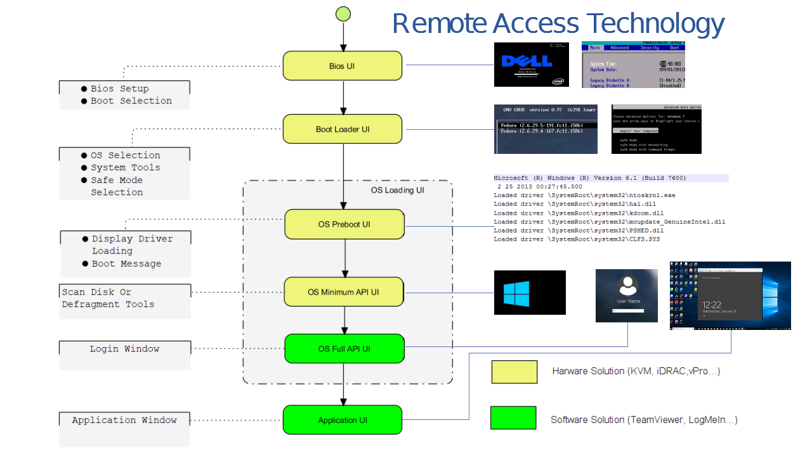
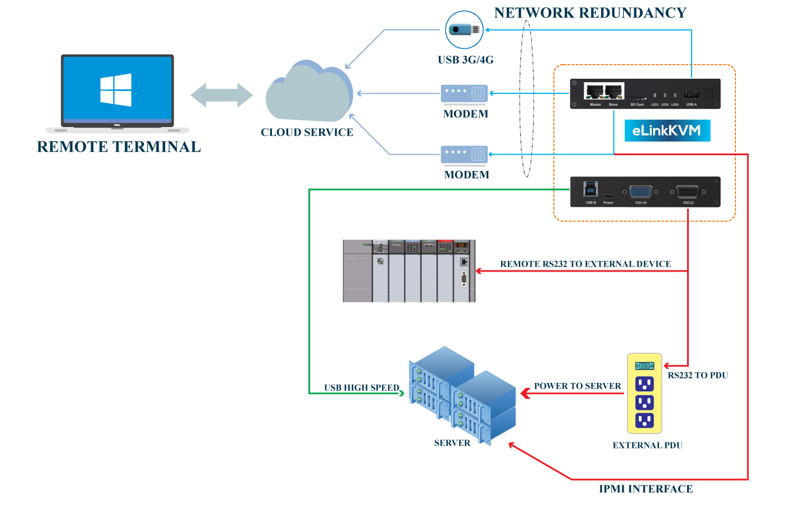
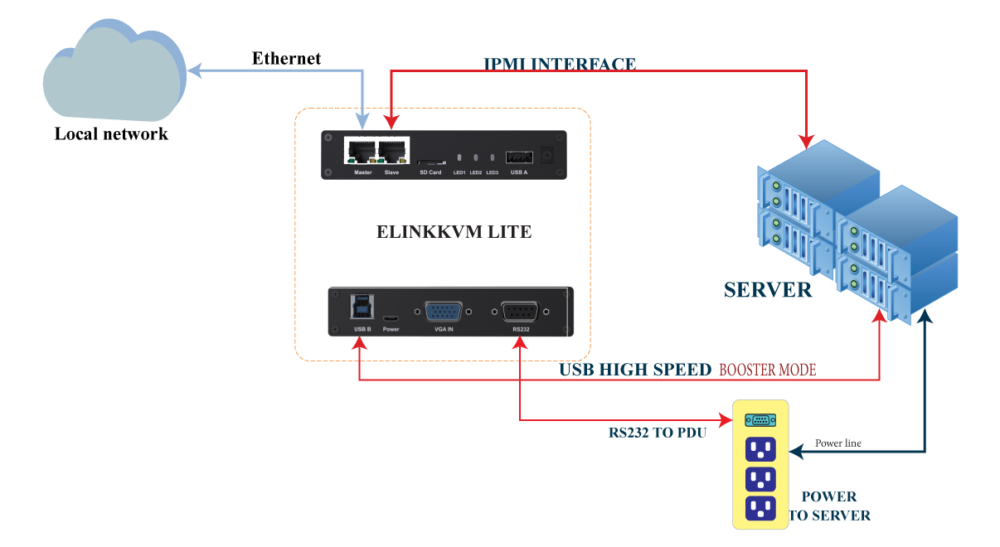
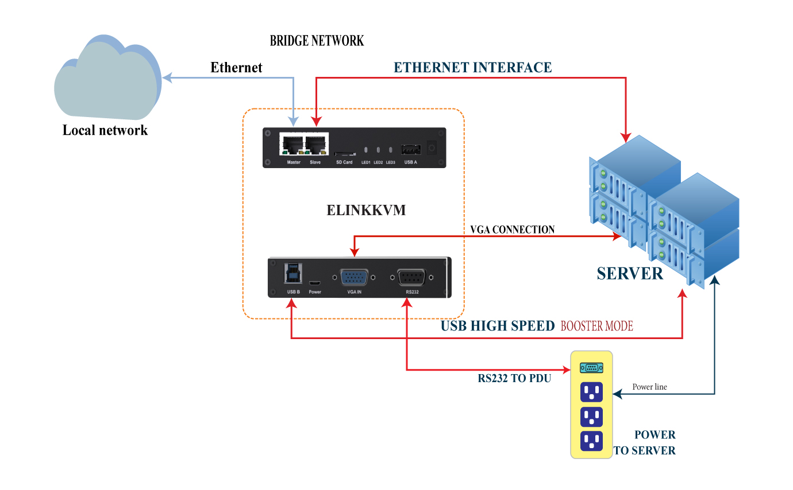
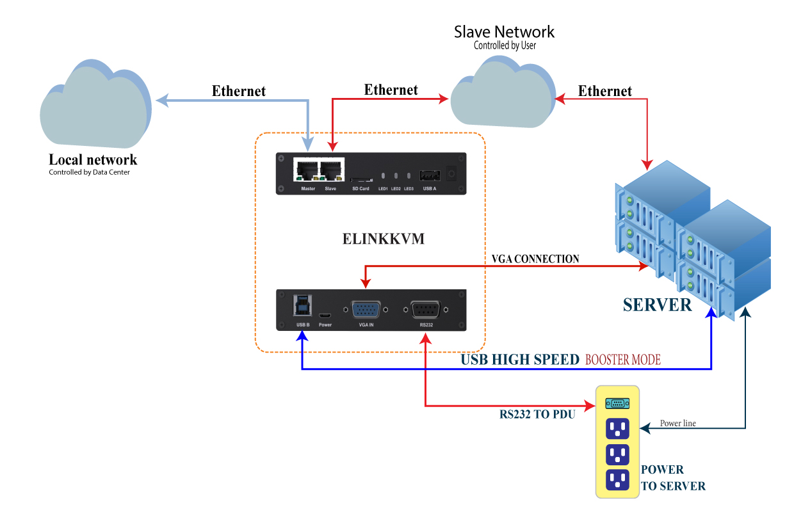
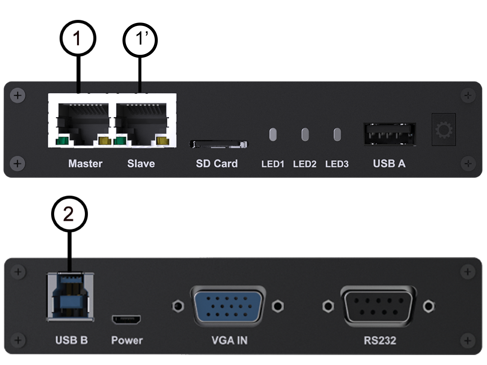
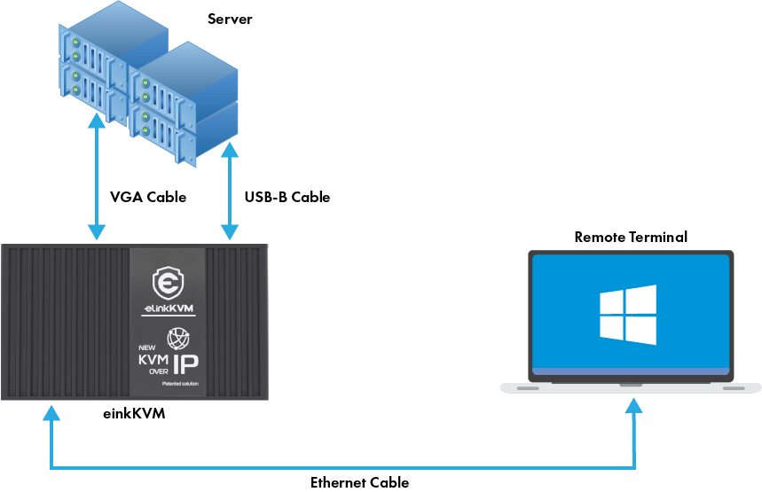

<!-- markdown-toc start - Don't edit this section. Run M-x markdown-toc-refresh-toc -->
**Table of Contents**

- [eLinkKVM Guide](#elinkkvm-guide)
    - [Chapter 1: Introduction](#chapter-1-introduction)
        - [a. Overview](#a-overview)
        - [b. Features](#b-features)
            - [Booster](#booster)
        - [c. Bundled hardware components](#c-bundled-hardware-components)
        - [d. Technical Specifications](#d-technical-specifications)
            - [i. Security](#i-security)
            - [ii. Target Server Requirements](#ii-target-server-requirements)
                - [Operating Sytems](#operating-sytems)
            - [Hardware specification](#hardware-specification)
                - [Front view](#front-view)
                - [Rear view](#rear-view)
                - [Internal](#internal)
            - [eLinkViewer](#elinkviewer)
    - [Chapter 2: Hardware Setup](#chapter-2-hardware-setup)
        - [a. First Power On](#a-first-power-on)
            - [Devices and cables](#devices-and-cables)
            - [Remote computer](#remote-computer)
            - [Remote terminal](#local-computer)
            - [eLinkKVM configuration](#elinkkvm-configuration)
        - [b. Network configuration](#b-network-configuration)
            - [Windows](#windows)
        - [c. Setup verification](#c-setup-verification)
    - [Chapter 3: Remote management software for eLinkKVM with eLinkViewer](#chapter-3-remote-management-software-for-elinkkvm-with-elinkviewer)
        - [a. Basic usage](#a-basic-usage)
            - [Login](#login)
            - [Quick usage](#quick-usage)
            - [Disconnect from an eLinkKVM device](#disconnect-from-an-elinkkvm-device)
        - [b. Dummy Screen](#b-dummy-screen)
            - [i. Home](#i-home)
            - [ii. Info/Status](#ii-infostatus)
            - [iii. Networks](#iii-networks)
            - [iv. COM Port](#iv-com-port)
            - [v. IPMI](#v-ipmi)
            - [vi. Admin](#vi-admin)
            - [vii. Upgrade](#vii-upgrade)
        - [c. eLinkKVM Toolbar](#c-elinkkvm-toolbar)
        - [d. Keyboard, Video and Mouse Settings](#d-keyboard-video-and-mouse-settings)
            - [Key:](#key)
            - [Mouse:](#mouse)
            - [Video:](#video)
            - [File browsing and disk image mounting:](#file-browsing-and-disk-image-mounting)
        - [e. Python Cnsole UI](#e-python-cnsole-ui)
        - [f. Event Log UI](#f-event-log-ui)
        - [g. IPMI Command Center](#g-ipmi-command-center)
    - [Chapter 4: eLinkKVM Configuration](#chapter-4-elinkkvm-configuration)
        - [a. User Management](#a-user-management)
        - [b. Network Configuration](#b-network-configuration)
            - [-](#-)
            - [Dynamic IP Configuration](#dynamic-ip-configuration)
        - [c. IPMI Configuration](#c-ipmi-configuration)
        - [d. Offline Configuration](#d-offline-configuration)
        - [e. Factory Reset](#e-factory-reset)
    - [Chapter 5: Booster Mode](#chapter-5-booster-mode)
        - [Customize Booster Mode](#customize-booster-mode)
    - [Chapter 6: elinkSetuptool](#chapter-6-elinksetuptool)

<!-- markdown-toc end -->


# eLinkKVM Guide

## Chapter 1: Introduction

### a. Overview

A KVM switch (an abbreviation stands for **K**eyboard, **V**ideo and **M**ouse") is a hardware device that enables a user to control multiple computers from one or more sets of keyboards, video monitors, and mice. For example, in the following diagram, the computer on the right is currently being controlled by the peripherals.

||
| :----------------------------------------------------------: |
|          *Figure 5: Account login UI*           |


###### [TODO] Replace Wikipedia diagram about with our original diagram

Normal KVM switches attach controlling and controlled devices directly to itself. In contrast, KVM over-IP switches, provides over-the-internet functionality. This means, instead of physically connected to a KVM switch through very long cables and are usually limited in a room, a floor or a building, the controlling devices can be anywhere in the world that can connect to a KVM over-IP switch and control the connected computers with a normal Internet connection.

Another approach for remote controlling is using pure software. However, as a pure software solution is usually limited only in an operating system environment. Without an operating system, a software solution is infeasible. Unlike software solutions for remote controlling, a hardware solution like a KVM switch can be used as a replacement for a computer monitor. This diagram demonstrates the scope difference between a software and a hardware solution:


||
| :----------------------------------------------------------: |
|          *Figure 5: Account login UI*           |


eLinkKVM is one of such KVM-over-IP devices. However, unlike other KVM-over-IP solutions that are solely hardware solutions, eLinkKVM takes on a unique hybrid approach that combines both hardware and software. While being a hardware solution similar to other KVM-over-IP switches, but unlike other KVM-over-IP switches, eLinkKVM takes a step further with its patented technology called `Booster`. `Booster` is a
software solution that works together with eLinkKVM hardware to uplift processing performance by utilizing computing resources of the remote hosts. `Booster` is not limited to an operating system
environment, but also in BIOS and UEFI environments.


||
| :----------------------------------------------------------: |
|          *Figure 5: Account login UI*           |


Operators can monitor and access their computers from remote locations using a remote control software. An eLinkKVM device connects to a local area network or directly to a personal computer (PC) using
a standard ethernet cable, then uses a USB cable and a video display cables to connect to a server and complete control it with Keyboard, Video and Mouse functionality from the eLinkKVM device.

Because the eLinkKVM uses the Internet as its data communication medium, the server it is connected to can be accessed from any authorized computer across the Internet, regardless of physical location.

A user at a remote location connect to the eLinkKVM via its IP address. Once a connection has been established and authorization granted, the remote computer can exchange keyboard, video and mouse
signals with the remote server (of which the eLinkKVM is attached to), just as if they were physically present and working on the equipment directly.

### b. Introduce about Booster ###

**Booster** is a patented technology that allows eLinkKVM to utilize computing resources from remote hosts to improve remote performance. To quickly summarize, Booster includes software agents
that work on major OS platforms (Windows, Linux and Mac OS) however,unlike traditional software solutions, Booster agents can also operate in BIOS and UEFI environments, independent of any operating
system. 

These software agents are installed on remote hosts to utilize the extra computing power on the remote hosts to accelerate screen data processing without affecting performance. This enables
higher quality remote screen and more responsive interactions with the remotely remote hosts.

**Booster** also helps reducing the loads on eLinkKVM devices, making eLinkKVM devices run cooler and extend the longevity of eLinkKVM devices, while delivering higher performance.

The following diagram shows the scope covered by Booster:


||
| :----------------------------------------------------------: |
|          *Figure 5: Account login UI*           |


### c. Features ###

The eLinkKVM is designed to help the IT person remotely operate the Server in most responsive and efficient way. The device is not only allowing remotely access at Bios Level which is similar traditional KVM over IP but also adding more features:

- **Full Bios-level control over an IP Network**

  The video capture hardware (Hardware mode) is designed to decode the video signal up to 1920x1080 that help to monitor the screen in any situation.

- **Patented Booster technology**

  Faster and higher resolution with Booster technology, a patent technology allows monitor the screen with faster transfer, any video resolution with just a USB connection for almost any situation. See the **Booster** chapter for more information.

- **Featureful native client software**

  Client software is bundled with many unique features: scripting and image recognition, to automate manual operations. See the eLinkViewer chapter for more information.      
* **Virtual Media support with 8GB Internal Flash or 64GB with SD Card** 

  Instead of using a separate computer as a share network storage to emulate the Virtual Media, eLinkKVM itself is a high performance shared network storage device.

* **USB-Powered Design**

  The power is getting from USB port of Server, no external power supply required

* **RS232 Serial Port**

  For Serial Console, Remote Dial In or control external PDU

* **Built-in IPMI (Intelligent Platform Management Interface) utility**

  eLinkKVM understands IPMI and allows control the server that support IPMI interface. The user may power on/off/reset server without using an external PDU

* **Support USB Host Interface**

  The USB Host port allow eLinkKVM control the USB 3G/4G, external USB storage or USB security device to add more functionality.

* **Flexible Two Ethernet Ports** 

  The Ethernet ports can be configured to work independently to connect 2 different networks with the master port can be configured as a DHCP server. Or 2 ports can be used to connect a server to a router, using a single server Ethernet port.

* **Built-In USB Hub** 

  Physically emulate all USB device (Mouse, Keyboard, Storage) with just one USB cables

* **Scalability** 

  eLinkKVM can scale to control more than one computers by connecting the computers to eLinkSwitch.

* **Compact form factor**

  Small footprint of eLinkKVM making it easy to attach to existing servers

* **Low cost**

  Ideal for distributed IT system environments such as small branch offices, campuses, test labs, and server hosting environments.

* **Remote firmware upgrade**
  Firmware can be easily upgraded remotely with a few mouse clicks.


### d. eLinkKVM Phyical Connections

eLinKVM can be flexibly setup to connect between a remote terminal and a remote host with many options. 

To connect a remote terminal over IP, the following methods can be used:

- Connect eLinkKVM directly to a router. A remote terminal then can access eLinkKVM over the Internet.
- Connect eLinkKVM directly to a USB 3G/4G. A remote terminal then can access eLinkKVM over the Internet.
- Direct connect eLinkKVM to the remote terminal. A remote terminal then can access eLinkKVM with a direct connection, Internet is not required.

After setting up, eLinkKVM is ready to be accessed by a remote terminal.

To connect a remote host to an already connected eLinkKVM device, the following methods can be used:

- Connect a VGA cable between the remote host and eLinkKVM to capture the host screen.
- Using a RS232 cable to capture its serial output.
- Connect the remote host to the Slave port on eLinkKVM to manage through IPMI interface.

After phsyical connections on both ends are done, a remote connection is up and running.

|             |
| :----------------------------------------------------------: |
| *Figure 1: Complete system eLinkKVM connect to Router, connect to IPMI server, USB, RS232, external PDU, USB 3G...** |

**Todo: Bỏ kết nối RS232 trong hình vẽ tới PDU vì IPMI có thể dùng để power/on/off (Kevin)**

||
| :----------------------------------------------------------: |
|              *Figure 2: ELinkKVM Lite A minimal connection just USB (to run Booster), eLinkKVM connect to Router, eLinkKVM connect to IPMI*              |

||
| :----------------------------------------------------------: |
|              *Figure 3: using feature network bridge to save network connection (network cable to eLinkKVM to Master Connector & from Slave Connector to Server), eLinkKVM connect USB to server*|

|  |
| :----------------------------------------------------------: |
|              *Figure 4: Seperate network layer*              |

| |
| :----------------------------------------------------------: |
|              *Figure 5: Extend function with USB device*              |

|             |
| :----------------------------------------------------------: |
| *Figure 6: ELinkKVM configure network through multiple network* |

### e. Technical Specifications

#### Hardware specification

| Feature                     | Description                                                                          |
|-----------------------------|--------------------------------------------------------------------------------------|
| Networks                    | 2 Ethernet  ports (10/100Mbps)                                                       |
| Storage                     | Internal Flash Storage (8GB) that can be accessed by eLinkViewer software            |
| Interfaces                  | Micro SD-CARD (extend up to 64GB)                                                    |
|                             | RS232 interface                                                                      |
|                             | USB Host interface to extend to USB 3G/4G, USB Wifi, USB Storage                     |
| Video                       | VGA Port, Video Full HD Resolution                                                   |
|                             | VGA Text mode: 640x350, 640x480, 720x400                                             |
|                             | VGA Graphic mode: 640x480, 800x600, 1024x768, 1152x864, 1280x1024,                   |
|                             | 1440x900,1680x1050,1600x1200,1920 x1080                                              |
|                             | Secure, full BIOS-level control of remote servers over an IP network                 |

#### Software Specification

| Feature                     | Description                                                                          |
|-----------------------------|--------------------------------------------------------------------------------------|
| Remote Access Features      | Support  VNC Protocol                                                                |
|                             | Emulation the USB Relative Mouse and Absolute Mouse                                  |
|                             | Emulation the USB Keyboard                                                           |
|                             | Capture Full HD resolution with **Hardware Mode**                                    |
|                             | Capture all resolutions with 100% screen quality using the patented **Booster Mode** |
| Connections                 | Direct Connect Through TCP/IP                                                        |
|                             | Extension through USB 3G/4G                                                          |
|                             | Coming the Cloud Service to connect behind Firewall                                  |
| Securities                  | Secure by SSL                                                                        |
|                             | Multiple Login Accounts (Up to 8 users)                                              |
| Remote Server Power Control | Remote Reset/On/Off  Server through an IPMI GUI Interface from eLinkViewer           |
|                             | Control the External PDU through RS232                                               |
| Virtual Media               | Disk images (.iso, .raw, .hdd, .hdd2** can be mounted as a USB 2.0 devices on        |
| Server power design         | No external power supply required                                                    |
|                             | on a remote computer for easy software installation and system updates               |
| Multi-purpose USB port      | Keyboard, Mouse and Storage functionalities are integrated in a single USB port.     |
| Compact form factor         | Making it easier to attach to existing servers                                       |
| Batch setup                 | Multiple eLinkKVM devices can be scripted by the eLinkViewer software to get         |
|                             | the same configuration.                                                              |

#### eLinkViewer Software Specification

**eLinkViewer** is an application specifically made to view remote screen content captured by an eLinkKVM device as well as interact with a remote computer. 

**eLinkViewer** also provides functionalities to manage an eLinkKVM device.

| Feature                | Description                                                  |
| ---------------------- | ------------------------------------------------------------ |
| General                | Support multiple VNC Server and eLinkKVM                     |
|                        | Remote protocol using VNC and extension commands for eLinkKVM |
|                        | Support video scaling and full screen                        |
| Automation             | Support image recognization and Python scripting allow automation the activities |
| IPMI                   | Support IPMI protocol to control server with GUI             |
| Platform               | Currently support Windows                                    |
| Bandwidth Optimization | Provide video quality settings to maximize remote performance for the available |
|                        | network bandwith                                             |
| Screen scaling         | Viewer screen can be scaled to any resolution independent from remote computer's |
|                        | resolution or even enter a full-screen mode. In full-screen mode, the viewer |
|                        | screen scales according to the remote computer's resolution. |

### f. Components ####

||
| :----------------------------------------------------------: |
|          *Figure 5: Account login UI*           |


##### Front view #####

| ID | Component  | Description                                                                                      |
|----|------------|--------------------------------------------------------------------------------------------------|
| 1  | USB Type-B | power the device and acts as a communication channel between eLinkKVM and a server               |
| 2  | Power      | the secondary source is supplied by a micro USB cable. It is neccessary when the power           |
|    |            | from USB Type B port is insufficient, or keeping the connection to eLinkKVM                      |
|    |            | alive when the server is power off.                                                              |
| 3  | VGA        | For capturing and outputting video signal to send and receive over the internet.                 |
| 4  | RS232      | the serial communication port (COM port**. This port will be connected to the server serial port. |

##### Rear view ######

| ID | Component                   | Description                                                              |
|----|-----------------------------|--------------------------------------------------------------------------|
| 1  | Ethernet ports (10/100Mbps) | Master: can be configured as a DHCP server, a DHCP client or a static IP |
|    |                             | Slave: can be configured as a DHCP Client or a static IP                 |
|    |                             |                                                                          |
| 2  | SD card                     | allows a user to expand storage capacity with an external micro SD card  |
| 3  | Status Leds 1,2,3           | signal device statuses through different led colors                      |
| 4  | USB Type-A                  | allow to attach an external peripheral device such as USB 3G/4G,         |
|    |                             | USB Mass Storage, etc., to extend eLinkKVM functionality.                |

## Chapter 2: Installing eLinkKVM ###

This chapter describes how to install the eLinkKVM device and necessary software to work with eLinkKVM . It contains the following sections:

- Package contents
- Power on eLinkKVM
- eLinkKVM in Setup Mode
- eLinkKVM in Operating Mode
- Network setup
- eLinkViewer setup

### a. Package Contents

In addition to the **eLinkKVM** device, the package contains the following items:

- 1 USB 2.0 Type-B Cable
- 1 VGA cable
- 1 RS232 cable (optional)
- 1 USB Power Adapter (5V - 2A) and Micro USB cable
- Mounting kit (see Chapter 4: Mounting Bracket Kit)
- Quick Start Guide

### b. Power On eLinkKVM

The USB-Powered design allow eLinkKVM power directly from server USB port (1) without an external power. But in some cases, it is necessary to keep the device active while the server can be turned off or eLinkKVM need to provide the power to external USB 3G. This can be done by supplying another 5V power source to the micro USB port (2) on an eLinkKVM device.


||
| :----------------------------------------------------------: |
|          *Figure 5: Account login UI*           |


During the bootup process the 3 LEDs will be blink and turn green when the device is ready. User can start using the device.


||
| :----------------------------------------------------------: |
|          *Figure 5: Account login UI*           |


| LED ID | Color | Description |
| ------ | ----- | ----------- |
| 1      | Green | TBD         |
| 2      | Green | TBD         |
| 3      | Green | TBD         |

### c. eLinkKVM in Setup Mode

|  |
| :----------------------------------------------------------: |
|              *Figure 4: Multiple network layer*              |

The eLinkKVM is designed to be just plug and play. User can just install the device in operation mode and start using immediately.  But there are some case when the auto DHCP IP address may not work the user may have to setup it manually. Below are the connection diagram when setup eLinkKVM


Perform following steps to configure eLinkKVM:

- (1) Connect Ethernet RJ45 cable between eLinkKVM and remote terminal
- (2) Connect USB Type-B cable to remote terminal and Type-B port of eLinkKVM device



### d. eLinkKVM in Operation Modes

The main usage of eLinkKVM is to remotely monitor a server. The basic connection is  described below where eLinkKVM is connected to Server through USB cable and VGA and connect to remote terminal through  ethernet.

|  |
| :----------------------------------------------------------: |
|          *Figure 5: Basic eLinkKVM Operating Mode*           |


Perform following steps to configure eLinkKVM:

- (1) Connect Ethernet RJ45 cable between eLinkKVM and remote terminal
- (2) Connect VGA cable between Server and VGA port on eLinkKVM
- (3) Connect USB Type-B cable between Server USB port and Type-B port of eLinkKVM device


||
| :----------------------------------------------------------: |
|          *Figure 5: Account login UI*           |


### e. Network configuration ###

We may not need to explain in detail how to config Window to get IP address as other manual don't explain that

eLinkKVM supports two Ethernet ports for network connection:

- Ethernet Master: by default, configured as a DHCP server.
- Ethernet Slave: by default, configured as a DHCP client.

To connect to an eLinkKVM device, a network connection between a remote terminal and an eLinkKVM device is required. The connection can either be:

- *Direct connect*: An ethernet cable connects directly between a remote terminal and an eLinkKVM device.

- *Local Area Network*: Both the remote terminal and an eLinkKVM device are connected to a local area network (LAN). eLinkKVM is plugged to the router of the network.

- *Over the Internet*: an eLinkKVM device is provided with a static address for a remote terminal to access it anywhere in the world.

When a connection is established, its network interface must be configured in the operating system of the remote terminal. Currently, only Windows is supported.

#### Windows ####

1. Open `Control Panel` -> `All Control Panel Items` -> `Network Connections`.

##### [TODO] Add an demo picture`

2. Right click on Ethernet Device of the eLinkKVM connection, select `Properties.

###### [TODO] Add an demo picture

3. Double click `Internet Protocol version 4 (TCP/IPv4)`

##### [TODO] Add an demo picture

4. Check the following options:

- Ontain an IP Address automatically
- Obtain DNS server address automatically

5. Verify the Setting

   The default address for Ethernet Master port is `10.0.0.1`. To check if the hardware is setup correctly:

   1. On Windows, open `cmd.exe`. On Linux and Mac OS, open a terminal emulator.

   2. Type the following command:

      `ping 10.0.0.1`

      If `ping** receives response packets, this means eLinkKVM is connected. To actually use eLinkKVM, the software eLinkViewer is required. The basic usage is described in the next chapter.

### c. Setup eLinkViewer

Download the eLinkViewer setup package from www.elinkgate.com/support/download.html just run setup.exe and following the instructions.

Go to chapter 3 (Basic usage) to see how to run and using eLinkViewer.


## Chapter 3: Remote management software for eLinkKVM with eLinkViewer ###

**Todo (Tú): refer the setup eLinkViewer above, explain how to get IP address of eLinkKVM, the viewer can connect to VNC compatible server and eLinkKVM...explain about 3 VNC mode: dummy, vga, booster. List down the feature of eLinkViewer here...Rearrange content as below**

1. Login
2. Basic Remote Control: Sending      Key, Mouse, Video Setting, scalling, send special keys...
3. eLinkKVM Mode Setting UI
4. Python Console UI
5. Event Log UI
6. File Transfer UI
7. IPMI Command Center
8. Serial Console (TBD)
9. eLinkViewer Image Capture
10. Operation Recording (TBD)

eLinkViewer is a specialized software for remote control and management of an eLinkKVM device. Booster technology is only available with eLinkViewer.

### a. Basic usage ###

#### Login ####

#### TODO need to disbale Local Account/Online Account 

To connect to an eLinkKVM device, fill the configured IP address in the textbox next to the **Server** field and click `Connect` to connect eLinkViewer to the eLinkKVM at the configured IP address:

||
| :----------------------------------------------------------: |
|          *Figure 5: Account login UI*           |

`Options`: configure eLinkKVM-VNC connection


||
| :----------------------------------------------------------: |
|          *Figure 5: Account login UI*           |

**Scan**: Scan for all eLinkKVM devices in the current local area network (LAN)

||
| :----------------------------------------------------------: |
|          *Figure 5: Account login UI*           |


After connecting to an eLinkKVM device, the viewer screen switches to `Dummy` screen. The `Dummy` screen displays device status and settings.


||
| :----------------------------------------------------------: |
|          *Figure 5: Account login UI*           |


||
| :----------------------------------------------------------: |
|          *Figure 5: Account login UI*           |


#### Quick usage ####

`Dummy` screen includes many tabs that displays an appropriate screen
for the functionality of each tab. Assume the eLinkKVM device is
properly setup with VGA cable attached, to start remote controlling,
simply switching from `Dummy` video screen to `VGA` video screen:

1. Click `ELink Configuration`.
2. Click `VGA`.
3. Click `OK`.

The default `Dummy` screen should be switched to the actual output
from the remote remote host.


||
| :----------------------------------------------------------: |
|          *Figure 5: Account login UI*           |

#### Disconnect from an eLinkKVM device ####

* Click the button 
* The dialog box  announces connection successfully terminated. 


||
| :----------------------------------------------------------: |
|          *Figure 5: Account login UI*           |


### b. Dummy Screen

#### i. Device Status

The default screen when successfully connected to an ElinkKVM device.


||
| :----------------------------------------------------------: |
|          *Figure 5: Account login UI*           |


#### ii. External Dock

Display basic info of Dock if current eLinkKVM connected to a eLink Dock


||
| :----------------------------------------------------------: |
|          *Figure 5: Account login UI*           |

#### iii. Networks

Display the current network configuration of an eLinkKVM device and
allows changes accordingly:


||
| :----------------------------------------------------------: |
|          *Figure 5: Account login UI*           |

#### iv. COM Port

Display the current COM port configuration of an eLinkKVM device and
allows changes accordingly:

### TODO need to add comport here 


||
| :----------------------------------------------------------: |
|          *Figure 5: Account login UI*           |

#### DHCP 

Display all IP address already allocated by DHCP server of eLinkKVM


||
| :----------------------------------------------------------: |
|          *Figure 5: Account login UI*           |

#### v. IPMI

Display the current IPMI configuration of an eLinkKVM device and
allows changes accordingly:

||
| :----------------------------------------------------------: |
|          *Figure 5: Account login UI*           |


#### vi. Admin

#### vii. Upgrade

Display the current firmware version of an eLinkKVM device and allows
upgrading to a newer firmware. The firmware must be first uploaded
onto the device using `File Transfer` feature of eLinkViewer.


||
| :----------------------------------------------------------: |
|          *Figure 5: Account login UI*           |

### c. eLinkKVM Toolbar ###

Connection user interface:

||
| :----------------------------------------------------------: |
|          *Figure 5: Account login UI*           |

1. Create a new connect to an eLinkKVM device


||
| :----------------------------------------------------------: |
|          *Figure 5: Account login UI*           |

2. Store current vnc session as a `.vnc` file

3. eLinkKVM connect options


||
| :----------------------------------------------------------: |
|          *Figure 5: Account login UI*           |

4. Current connection status
5. Pause frame transmitting
6. Request refresh current remote screen
7. Send `Ctrl + Alt + Delete` key combination
8. Press/Hold `Ctrl` key
9. Press/Hold `Alt` key
10. Open eLinkViewer `File Transfer` window


||
| :----------------------------------------------------------: |
|          *Figure 5: Account login UI*           |

eLinkViewer allows data transfer from a local PC to an eLinkKVM device
with `File Transfer`:

* Click **`File Transfer`** on eLinkViewer toolbar . `File Transfer`
  window appears. To the left is a directory tree of the local PC, to
  the right is the directory tree of the eLinkKVM device.

* Browse the local directory tree and select a file or directory to
  upload to an eLinkKVM device. Next, on the directory tree of the
  eLinkKVM device, select a path to store the file or directory.

* Finally, click the button **`>>`** to transfer the selected
  file/directory. A confirm dialog appears. Click **`Yes`** to confirm
  or click **`No`** cancel the action. After confirming the transfer,
  the transfer starts and a progress bar that displays the transfering
  process starts running.


11. Scale in
12. Scale out
13. Scale (100%)
14. Auto zoom 
15. Full screen (press `Ctrl + Shift + Alt + F` to return to windowed eLinkViewer)
16. Turn booster mode on/off
17. eLinkKVM Configuration
18. Open event log 
19. Open Python script command prompt
20. Disconnect
21. Scan IPMI 

| |
| :----------------------------------------------------------: |
|          *Figure 5: Account login UI*           |

### d. Keyboard, Video and Mouse Settings


||
| :----------------------------------------------------------: |
|          *Figure 5: Account login UI*           |

The viewer provides a dialog called `Elink Configuration` that includes the following options to configure how an eLinkKVM emulates keyboard, video and mouse.

#### Key: ####

* HID USB : use real keyboard (USB). 
* HID VNC : use software keyboard (VNC protocol)
* Serial: use software keyboard (serial protocol)

#### Mouse: ####

* HID USB : use real mouse (USB)
* HID VNC: use software mouse (VNC protocol)
* ABS USB: use real mouse, but sync both local and remote mouse as one mouse pointer (USB absolute hid)

#### Video: ####

* Dummy : configure network and serial connections
* VGA: configure VGA display
* Booster: enable remote management with Booster. This will be covered in later chapters. 
* Serial: enable serial display and communication
* IPMI:  enable Serial Over Lan (SOL) with IPMI 

#### File browsing and disk image mounting: ####

* Path 0/1/2/3: File paths to disk images

* `Browse` button allows navigating to the disk images with a file
  explorer:


||
| :----------------------------------------------------------: |
|          *Figure 5: Account login UI*           |

* Example: Configure eLinkKVM to use USB Key, Vnc Mouse and Booster
  mode with `refind.hdd2` disk image:


||
| :----------------------------------------------------------: |
|          *Figure 5: Account login UI*           |

### e. Python Console UI

#### TODO

### f. Event Log UI


||
| :----------------------------------------------------------: |
|          *Figure 5: Account login UI*           |

### g. IPMI Command Center

IPMI Interface:

||
| :----------------------------------------------------------: |
|          *Figure 5: Account login UI*           |

IPMI command center allows a user to scan servers with IPMI ports in a local area network and connect to these server to run IPMI commands.

* Start IP: start IP to begin scanning
* Stop IP: End IP to end scanning
* User Name - Password: user name and password for each IPMI server. For example, default username and password are ADMIN/ADMIN for a Super Micro server.
* Scan : start scanning for an IPMI server 
* Stop: End a current scanning process
* Connect: connects to an IPMI server. When an IPMI server is found, an IP address is display, click on the IP address to select then enter a Username and Password.
* Power On: Turn a server on with IPMI
* Reset  with   
* Reset : restart a server
* Reset to Bios Setup: restart a server and enter BIOS
* Reset to USB: restart a server and boot with a USB device
* Sol Active: enable IPMI management with Serial Over Lan (SOL)
* Close : Close IPMI command center

Use IPMI command center to scan and run IPMI commands. 

* Click 
* Enter Start IP and end IP. Limit the ranger of IP scanning. 
* Click `Scan` to start scanning. Found IPMI servers are displayed as a list.
* Click on one of the found IPMI IP addresses, enter `Username` and `Password`, then click **`Connect`** 
* Click **`Power On`**,  **`Reset`**, etc., to run appropriate IPMI commands.


||
| :----------------------------------------------------------: |
|          *Figure 5: Account login UI*           |


## Chapter 4: eLinkKVM Configuration

### a. User Management

### b. Network Configuration

##### Static IP configuration

Steps to configure static IP for an eLinkKVM device:

1. Power up an eLinkKVM device and wait for the device to start up completely (all LED1 , LED2, LED 3 light up).

2. Use a Ethernet (RJ45) cable to connect a PC to the Ethernet Master port. The default IP is `10.0.0.1`.

4. Open eLinkViewer, enter `*10.0.0.1*` and click `Connect` to connect to the eLinkKVM device:


||
| :----------------------------------------------------------: |
|          *Figure 5: Account login UI*           |

When connected, eLinkViewer displays its home screen with many tabs for different screens. One of the tab is `Network`. Click on `Network` tab to move to this screen:


||
| :----------------------------------------------------------: |
|          *Figure 5: Account login UI*           |

5. The `Network` screen displays the following fields: 

- IP Address
- Netmask
- Gateway
- DNS

Similar to how an ethernet adapter can be configured in an operating system.

**Example**:

Instead of using the default IP address `10.0.0.1`, the IP address of the connected eLinkKVM can be changed to `10.0.0.2`.

```
Ip address: 10.42.0.2
Netmask: 	255.255.255.0 
GateWay: 	10.42.0.1 
DNS: 		10.42.0.1
```


||
| :----------------------------------------------------------: |
|          *Figure 5: Account login UI*           |

||
| :----------------------------------------------------------: |
|          *Figure 5: Account login UI*           |


##### Dynamic IP Configuration

Dynamic IP address is acquired automatically, issued by a DHCP server. In this case, the connected eLinkKVM device must be configured as a DHCP client.

###### [TODO] Put a screenshot showing how to select DHCP Client

### c. IPMI Configuration

### d. Offline Configuration

eLinkKVM supports configuration with a text file. Steps: 

|
| :----------------------------------------------------------: |
|          *Figure 5: Account login UI*           |

1. Press `Enter Configuration` button an eLinkKVM device. The firmware on the eLinkKVM device then configures itself as a storage device.
2. Open the drive `ELINKCONF`.
3. In `ELINKCONF` drive, there is a configuration file that can be editted by any text editor. 
4. Edit the file following eLinkKVM configuration syntax. Store the file and reset eLinkKVM to use the new configuration.


||
| :----------------------------------------------------------: |
|          *Figure 5: Account login UI*           |

### e. TODO Factory Reset


## Chapter 5: Booster Mode

Booster is a patented technology for eLinkKVM and related ElinkGate
products. Booster includes software agents for each major OS platform
(Windows, Linux and Mac OS) that are installed on controlled
computers. When an eLinkKVM device is attached to a controlled
computer, the installed software agent is activated to cooperate with
a eLinkKVM device using a specialized proprieteray protocol. The
software agent then utilizes the available computing resources on the
remote host to greately accelerate video input and output
processing. As a result, eLinkKVM can deliver higher performance at
higher resolutions for an extremely economical price.

To enable Booster techonlogy, a user only needs to install the
accompanied software components on an existing operating-system
installation. For a fresh computer that need a new operating-system
installation, a tool called `elinkSetuptool` is provided to help
creating install disk images with embedded Booster from existing
installation ISO files, which is covered in the next chapter.

These disk images can be loaded on eLinkKVM internal storage for
remote operating-system installations on new computers with Booster
enabled through the whole installation process. After the installation
process is done, the freshly installed operating system is also
pre-installed with Booster software to allow a user to continue using
Booster without any interruption.


||
| :----------------------------------------------------------: |
|          *Figure 5: Account login UI*           |

Once a Booster agent is installed on a respective operating system,
simply click the `Booster` icon to start getting remote screen with
Booster. 


||
| :----------------------------------------------------------: |
|          *Figure 5: Account login UI*           |
Screen quality may improve slightly or significantly compared to VGA
hardwrae mode, depends on the quality of the VGA cable. Remote
keyboard and mouse interactions become much more responsive.

### Customize Booster Mode ###

To make it convenient to switch between Booster and other modes,
eLinkViewer allows a user to customize Auto Booster Toggle
button. Pressing this button allows a user to switch between a
pre-configured Booster mode and the current mode.


Steps to configure Booster mode:

1. Click `ELink Configuration` button.

2. From `ELink Configuration` select a remote display mode.

3. Similarly, select a Key mode

4. Next, select a Mouse mode

5. Select `Base` to confirm configuration. This configuration is used whenever `Auto Booster Mode` button is clicked.

6. Press OK to save the configuration.

7. Press OK to confirm.
||
| :----------------------------------------------------------: |
|          *Figure 5: Account login UI*           |


## Chapter 6: Multi user manager 
#### Multiple User 

- Support up to 8 device 
- multiple role : 
  - Admin  : Data center  admin account. Can create other lower priority account types like Manager and User 
  - Manager:  User manager account. Can create User account 
  - User:  Access account
||
| :----------------------------------------------------------: |
|          *Figure 5: Account login UI*           |
**Note** : For the first time configure, the default user name and password of ELinkKVM is `admin/admin`
click to icon User Configure bellow to open User Account Configuration

Create new account by click to blank field, enter password and select the rule for for the new account 

Create new account 
#### TODO  add animation for Create new user by elinkviewer
## Chapter 6: elinkSetuptool ###
`elinkSetuptool` is an image creation tool that recreates OS
installation images into disk images with `Booster` agents installed.
